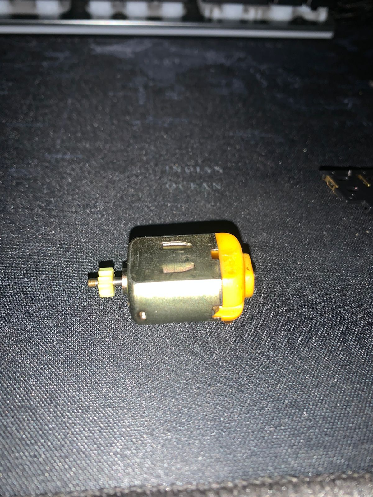
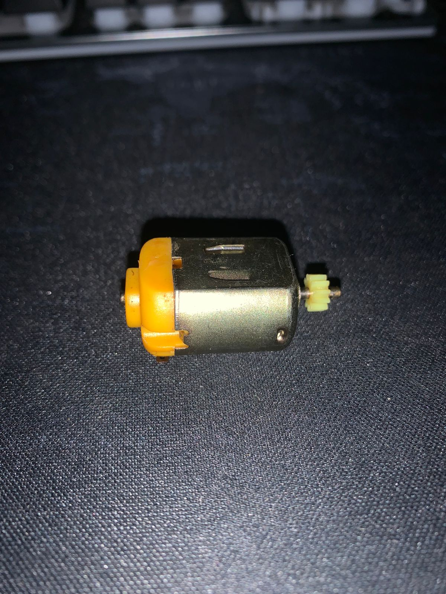
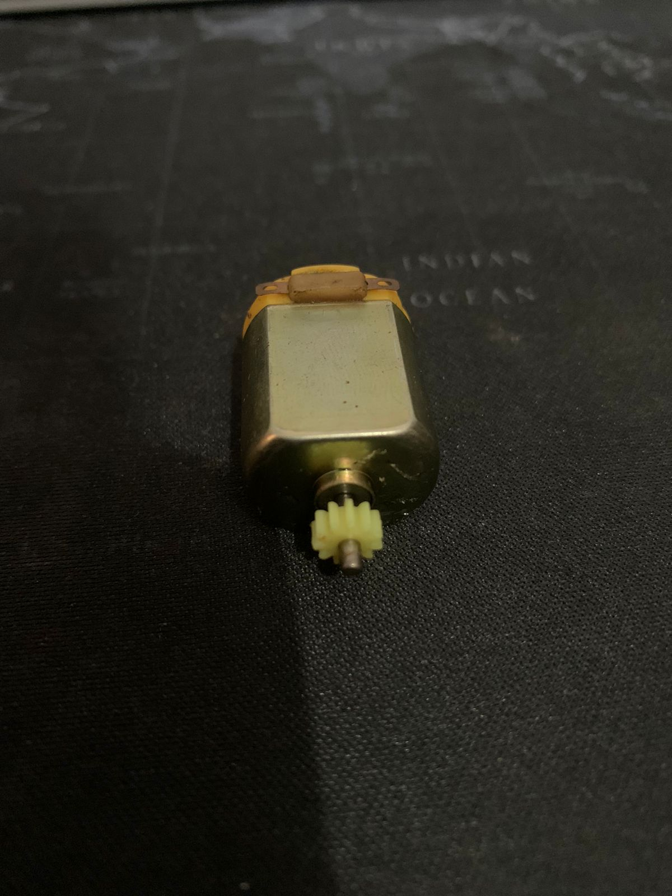
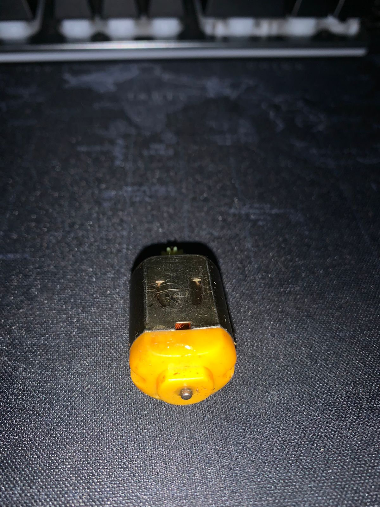

### Tugas 1 WEBGL
- Cari benda di sekitar Anda yang berawalan huruf D, I, atau N.
- Letakkan benda tersebut di atas permukaan datar: meja, lantai, dsb.
- Ambil foto benda tersebut dari empat sudut pandang yang berbeda: kanan atas, kiri atas, belakang atas, depan atas (sudut kemiringan bebas).

benda: Dinamo

